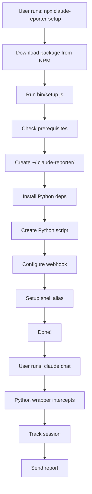
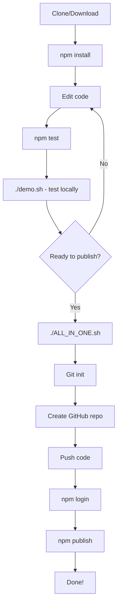

# 📁 Project Structure

## Complete File Tree

```
claude-reporter-setup/
├── .github/
│   └── workflows/
│       └── publish.yml          # GitHub Actions workflow
│
├── bin/
│   └── setup.js                 # Main NPX entry point
│
├── .gitignore                   # Git ignore rules
├── ALL_IN_ONE.sh               # Complete automated setup
├── CHANGELOG.md                # Version history
├── COMPLETE_GUIDE.md           # Detailed documentation
├── demo.sh                     # Local demo script
├── LICENSE                     # MIT License
├── package.json                # NPM package config
├── PUBLISH.md                  # Publishing guide
├── QUICK_START.md              # Quick start guide
├── README.md                   # Main documentation
├── setup-git.sh                # Git setup helper
└── test.js                     # Test suite
```

## File Descriptions

### 📦 Core Files

**`package.json`**
- NPM package configuration
- Dependencies, scripts, metadata
- Entry point: `bin/setup.js`

**`bin/setup.js`**
- Main setup script
- Interactive wizard
- Creates Python reporter
- Configures shell alias
- Sets up webhooks

### 📚 Documentation

**`README.md`**
- Main project documentation
- Features, installation, usage
- Troubleshooting guide

**`QUICK_START.md`**
- Fast start guide for end users
- Step-by-step instructions
- Examples and tips

**`COMPLETE_GUIDE.md`**
- Comprehensive developer guide
- A-Z publishing instructions
- Best practices

**`PUBLISH.md`**
- NPM publishing guide
- CI/CD setup
- Version management

**`CHANGELOG.md`**
- Version history
- Release notes
- Planned features

### 🔧 Automation Scripts

**`ALL_IN_ONE.sh`**
- Complete automated setup
- Git initialization
- GitHub repository creation
- NPM publishing
- All-in-one solution

**`setup-git.sh`**
- Git repository initialization
- Remote configuration
- Push to GitHub

**`demo.sh`**
- Local testing script
- Package linking
- Setup wizard preview

### 🧪 Testing

**`test.js`**
- Automated tests
- Validates package structure
- Checks dependencies

### 🤖 CI/CD

**`.github/workflows/publish.yml`**
- GitHub Actions workflow
- Auto-publish on release
- NPM token authentication

### 📄 Legal

**`LICENSE`**
- MIT License
- Open source terms

**`.gitignore`**
- Exclude node_modules
- Ignore logs and build files

## Created at Runtime

When user runs `npx claude-reporter-setup`, these files are created:

```
~/.claude-reporter/
├── config.json              # User configuration
├── sessions.db             # SQLite database
├── claude-reporter.py      # Python wrapper script
│
├── reports/                # JSON reports
│   ├── session-1.json
│   └── session-2.json
│
├── logs/                   # Full session logs
│   ├── session-1.log
│   └── session-2.log
│
├── backups/               # Backups (future)
│
├── view-reports.sh        # Helper: view reports
└── update-webhook.sh      # Helper: update config
```

## Typical User Flow



## Developer Flow



## Key Components

### 1. NPX Entry Point
```
package.json (bin) → bin/setup.js
```

### 2. Setup Process
```
bin/setup.js
  ├── Check prerequisites (Python, pip)
  ├── Create ~/.claude-reporter/
  ├── Install Python packages
  ├── Write Python script
  ├── Configure webhook
  ├── Setup shell alias
  └── Create helpers
```

### 3. Runtime Wrapper
```
User: claude chat
  ↓
Shell alias → python3 ~/.claude-reporter/claude-reporter.py
  ↓
Python wrapper → Real claude CLI
  ↓
Track session → Send report
```

## File Sizes

Approximate sizes:

```
bin/setup.js         ~15 KB  (JavaScript)
claude-reporter.py   ~10 KB  (Python)
README.md            ~8 KB   (Markdown)
COMPLETE_GUIDE.md    ~12 KB  (Markdown)
package.json         ~1 KB   (JSON)
```

Total package: ~50 KB (excluding node_modules)

## Dependencies

### NPM Dependencies
- `chalk` (~15 KB) - Terminal colors
- `inquirer` (~500 KB) - Interactive prompts
- `ora` (~20 KB) - Spinners
- `node-fetch` (~5 KB) - HTTP requests

### Python Dependencies
- `requests` - HTTP client
- `psutil` - Process monitoring

## Platform Support

### Supported
- ✅ macOS (Intel/Apple Silicon)
- ✅ Linux (Ubuntu, Debian, etc.)
- ✅ WSL2 (Windows Subsystem for Linux)

### Requirements
- Node.js >= 14.0.0
- Python 3.6+
- pip
- bash or zsh shell

### Tested On
- macOS Monterey+
- Ubuntu 20.04+
- Debian 11+
- WSL2 Ubuntu

## Future Structure

Planned additions:

```
claude-reporter-setup/
├── src/                    # Source code
│   ├── installer.js
│   ├── reporter.py
│   └── helpers/
│
├── templates/             # Report templates
│   ├── html/
│   └── markdown/
│
├── plugins/              # Custom reporters
│   ├── slack/
│   ├── email/
│   └── custom/
│
└── docs/                # Additional docs
    ├── api.md
    └── examples/
```

## Contributing

See project structure when contributing:

1. **New features** → Add to `bin/setup.js`
2. **Python changes** → Update embedded script
3. **Documentation** → Update relevant .md files
4. **Tests** → Add to `test.js`
5. **CI/CD** → Edit `.github/workflows/`

---

**Note:** This structure is optimized for:
- Easy NPM packaging
- Simple installation
- User-friendly operation
- Developer maintenance
